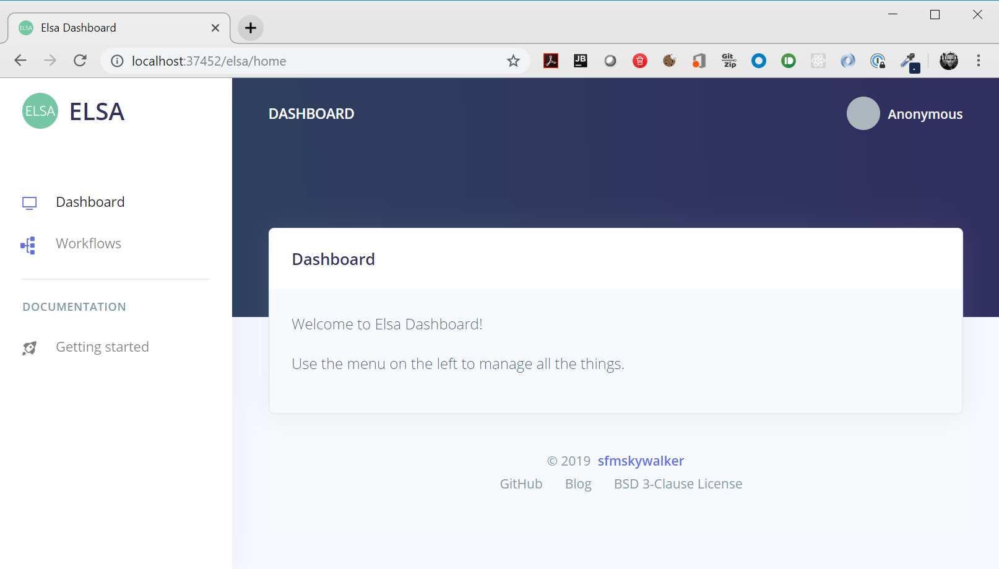
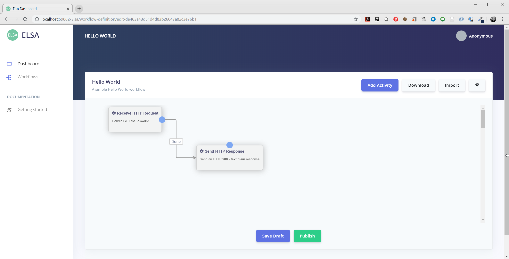
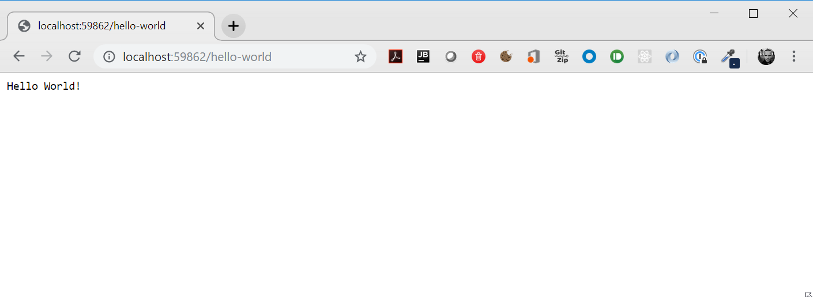
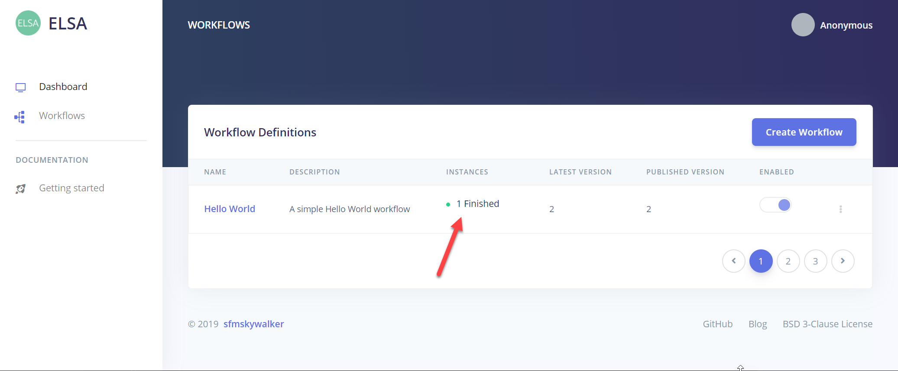
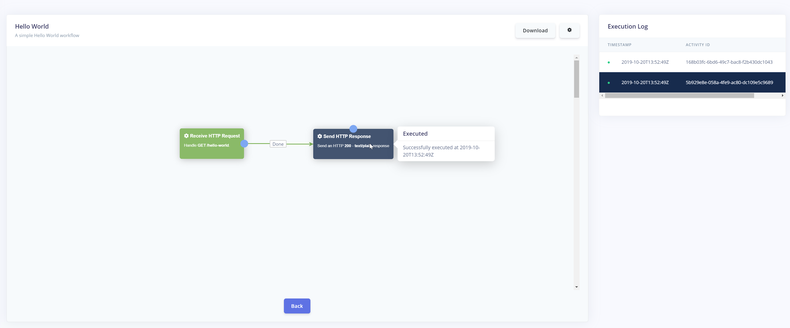

In this guide, we will see what it takes to setup the Dashboard and a Workflow Host that will run workflows created from the Dashboard.

Specifically, we will do the following:

* Create a new ASP.NET Core web application that hosts the Elsa Dashboard and various Elsa services to run workflows.
* Configure the Entity Framework Core provider. 
* Visually create some workflows.  

Let's get to it!

## Create the ASP.NET Core Project

> Elsa is currently still in preview and not yet published to NuGet. Make sure to [add the MyGet feed](./installing-preview-feed.md) first.

Create a new, empty ASP.NET Core 3.0 project called `Elsa.Guides.Dashboard.WebApp` and add the following packages:

* Elsa.Core
* Elsa.Activities.Email
* Elsa.Activities.Http
* Elsa.Activities.Timers
* Elsa.Dashboard
* Elsa.Persistence.EntityFrameworkCore

## Update Startup

Update the `Startup` class with the following code:

```csharp
using Elsa.Activities.Email.Extensions;
using Elsa.Activities.Http.Extensions;
using Elsa.Activities.Timers.Extensions;
using Elsa.Dashboard.Extensions;
using Elsa.Extensions;
using Elsa.Persistence.EntityFrameworkCore.Extensions;
using Microsoft.AspNetCore.Builder;
using Microsoft.AspNetCore.Hosting;
using Microsoft.EntityFrameworkCore;
using Microsoft.Extensions.Configuration;
using Microsoft.Extensions.DependencyInjection;

namespace Elsa.Guides.Dashboard.WebApp
{
    public class Startup
    {
        public Startup(IConfiguration configuration)
        {
            Configuration = configuration;
        }
        
        private IConfiguration Configuration { get; }

        public void ConfigureServices(IServiceCollection services)
        {
            services.AddControllersWithViews();
            
            services
                // Add services used for the workflows runtime.
                .AddWorkflows()
                .AddHttpActivities(options => options.Bind(Configuration.GetSection("Elsa:Http")))
                .AddEmailActivities(options => options.Bind(Configuration.GetSection("Elsa:Smtp")))
                .AddTimerActivities(options => options.Bind(Configuration.GetSection("Elsa:Timers")))
                
                // Add services used for the workflows dashboard.
                .AddElsaDashboard(options => options.DiscoverActivities())
                
                // Add services used for persistence. 
                .AddEntityFrameworkCoreWorkflowDefinitionStore()
                .AddEntityFrameworkCoreWorkflowInstanceStore()
                .AddEntityFrameworkCore(
                    options => options
                        .UseSqlite(Configuration.GetConnectionString("Sqlite"))
                );
        }

        public void Configure(IApplicationBuilder app, IWebHostEnvironment env)
        {
            app
                .UseStaticFiles()
                .UseHttpActivities()
                .UseRouting()
                .UseEndpoints(endpoints => endpoints.MapControllers())
                .UseWelcomePage();
        }
    }
}
```

## Update appsettings.json

As you can see, we are configuring the **HTTP**, **Email** and **Timer** activities by binding their options with `Configuration`. Although you could certainly do the configuration manually, let's update `appsettings.json` as follows:

```json
{
  "ConnectionStrings": {
    "Sqlite": "Data Source=c:\\data\\elsa-dashboard.db;Cache=Shared"
  },
  "Elsa": {
    "Http": {
      "BaseUrl": "http://localhost:59862"
    },
    "Smtp": {
      "Host": "localhost",
      "Port": "2525"
    },
    "Timers": {
      "SweepInterval": "PT10S"
    }
  }
}
```

## Run EF Migrations

Before the application becomes operational, we need to create the Sqlite database. The `Elsa.Persistence.EntityFrameworkCore` package comes with the necessary migrations that we can run.

In order to be able to run these migrations, we need to create a class that inherits from `DesignTimeElsaContextFactory`. The reason is so that the EF tooling is able to recognize the existence of the `ElsaContext` class.

Let's create the following class:

```csharp
using Elsa.Persistence.EntityFrameworkCore;

namespace Elsa.Guides.Dashboard.WebApp
{
    // To run migrations:
    // SET EF_PROVIDER=Sqlite
    // SET EF_CONNECTIONSTRING=Data Source=c:\data\elsa-dashboard.db;Cache=Shared
    // dotnet ef database update --context ElsaContext

    public class ElsaContextFactory : DesignTimeElsaContextFactory
    {
    }
}
```

Build the project, then open a terminal window and navigate to the `src\Elsa.Guides.Dashboard.WebApp` folder.
The `DesignTimeElsaContextFactory` expects two environment variables to be present:

- EF_PROVIDER (defaults to `Sqlite`)
- EF_CONNECTIONSTRING (defaults to `Data Source=c:\data\elsa.db;Cache=Shared`) 

Enter the following commands:

```bash
SET EF_CONNECTIONSTRING=Data Source=c:\data\elsa-dashboard.db;Cache=Shared
dotnet ef database update --context ElsaContext
```

If everything worked out, there should now be a `elsa-dashboard.db` file in `c:\data`.

## Launch the Dashboard

With that in place, you should now be able to launch the application. When you do, you'll see the ASP.NET Core welcome page.
Navigate to `/elsa/home` to see the dashboard:



## Create a Workflow

From the left menu, select `Workflows`. The list of workflow definitions is empty. Select the `Create Workflow` button to the right.

Right-click anywhere on the canvas and click `Add Activity` to add the first activity. Select the `Receive HTTP Request` activity. When added, double-click that activity to configure its properties as follows:

- Path: `/hello-world`
- Method: `GET`
- Read Content: `unchecked`

Add another workflow of type `Send HTTP Response` and configure it as follows:

- Status Code: `200`
- Content: `Hello World!`
- Content Type; `text/plain`
- Response Headers: `x-powered-by:Elsa Workflows`

Make sure to connect the two activities.
 
Before hitting `Publish`, click the cogwheel to the top right of the designer and provide a name and a description for the workflow. For example:

- Name: `Hello World`
- Description: `A simple Hello World workflow`

The workflow should look like this:



## Invoke the Workflow

To try the workflow, open a browser and navigate to http://localhost:59862/hello-world.

You should see the following result:



## Inspecting Workflow Execution

Go back to the Dashboard and select `Workflows` from the left menu.
You should see a list of workflows with only one workflow titled `Hello World` and one finished instance.



Click on `1 Finished` to see a list of finished workflow instances:


Click on the hyperlinked workflow instance ID to get to its details:



Notice that as you hover over each activity, the corresponding **activity execution log entry** is highlighted as well, making it easy to inspect which activities ran in what order.

## Summary

In this walkthrough, we've seen how to create an ASP.NET Core application that hosts both the dashboard and the workflow runtime.
Although we used a simple Hello World workflow, you can implement long-running workflows with ease.

For example, try importing [this workflow definition workflow](./assets/document-approval-workflow.json) into the designer.
It's the same workflow as described in [A Simple Document Approval Workflow](guides-document-approval.md).

Although we were hosting both the Dashboard and Workflow Host in the same ASP.NET Core application, this is not mandatory. It's common to separate the dashboard from the workflow runtime. Just make sure the two applications connect with the same database, unless you have a different strategy in place to publish workflow definitions to the runtime.

## Source

https://github.com/elsa-workflows/elsa-guides/tree/master/src/Elsa.Guides.Dashboard.WebApp