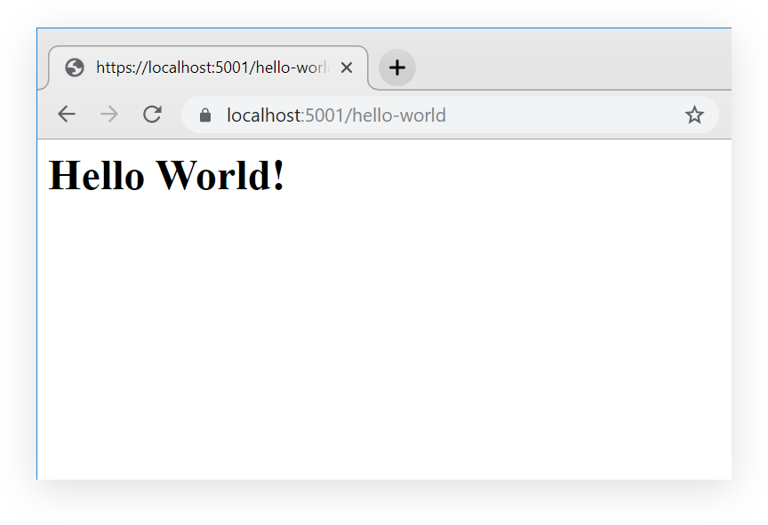

In this guide, we will do the following:

* Create an ASP.NET Core application.
* Programmatically define a workflow definition that executes when an HTTP request comes in at a specified URL.

Let's get to it!   

## Create ASP.NET Core Project

Create a new, empty ASP.NET Core project called `Elsa.Guides.HelloWorld.WebApp` and add the following packages:

* Elsa.Core
* Elsa.Activities.Http

## Create Workflow Class

Create a new class called `HelloWorldHttpWorkflow` and add the following code:

```csharp
using System;
using System.Net;
using System.Net.Http;
using Elsa.Activities.Http.Activities;
using Elsa.Expressions;
using Elsa.Services;
using Elsa.Services.Models;

namespace Elsa.Guides.HelloWorld.WebApp
{
    public class HelloWorldHttpWorkflow : IWorkflow
    {
        public void Build(IWorkflowBuilder builder)
        {
            builder
                .StartWith<ReceiveHttpRequest>(
                    x =>
                    {
                        x.Method = HttpMethod.Get.Method;
                        x.Path = new Uri("/hello-world", UriKind.Relative);
                    }
                )
                .Then<WriteHttpResponse>(
                    x =>
                    {
                        x.Content = new LiteralExpression("<h1>Hello World!</h1>");
                        x.ContentType = "text/html";
                        x.StatusCode = HttpStatusCode.OK;
                        x.ResponseHeaders = new LiteralExpression("X-Powered-By=Elsa Workflows");
                    }
                );
        }
    }
}
```

## Update Startup

Next, open `Startup.cs` and insert the following code:

```csharp
using Elsa.Activities.Http.Extensions;
using Elsa.Extensions;
using Elsa.Services;
using Microsoft.AspNetCore.Builder;
using Microsoft.Extensions.DependencyInjection;

namespace Elsa.Guides.HelloWorld.WebApp
{
    public class Startup
    {
        public void ConfigureServices(IServiceCollection services)
        {
            services
                .AddElsa()
                .AddHttpActivities()
                .AddWorkflow<HelloWorldHttpWorkflow>;
        }

        public void Configure(IApplicationBuilder app)
        {
            app.UseHttpActivities();
        }
    }
}
``` 

## Run

Run the program and wait until you see the following output:

```text
Now listening on: http://localhost:5000
Now listening on: https://localhost:5001
Application started. Press Ctrl+C to shut down.
```

Open a browser window or a tool like [Postman](https://www.getpostman.com/) and navigate to `https://localhost:5001/hello-world`.

The result should look like this:



## Summary

In this guide, we've seen how to setup a workflow that is triggered when an HTTP request comes in.
Implementing HTTP workflows is a great way to easily implement logic in response to HTTP requests quickly. 

## Source

https://github.com/elsa-workflows/elsa-guides/tree/master/src/Elsa.Guides.HelloWorld.WebApp