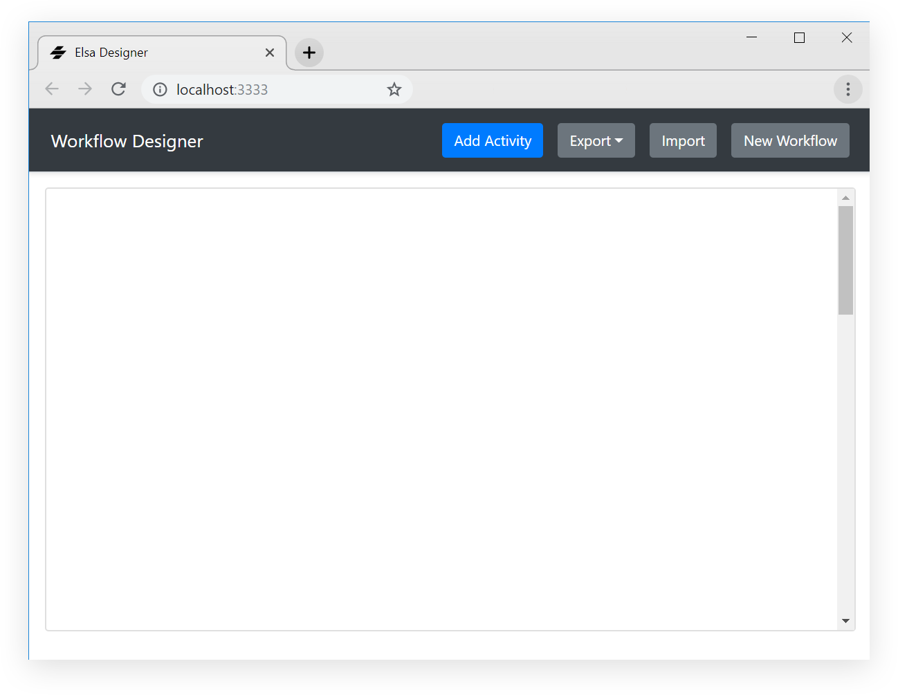

> NOTE: There's no need to install the designer yourself if you are using [Elsa Dashboard](./installing-elsa-dashboard.md). Elsa Dashboard already embeds the designer in the appropriate MVC view.
>
> The below guide is intended for those who wish to reuse the HTML5 workflow designer web component without relying on Elsa Dashboard.

The easiest way to install the Elsa workflow designer is by including the following script tag in your HTML document:

```html
<script src='https://unpkg.com/@elsa-workflows/elsa-workflow-designer/dist/elsa-workflow-designer.js'></script>
```

Alternatively, you can install the package using NPM. For more details, see [https://www.npmjs.com/package/@elsa-workflows/elsa-workflow-designer](https://www.npmjs.com/package/@elsa-workflows/elsa-workflow-designer)

## Dependencies

The designer web component has an external dependency on [Bootstrap](https://getbootstrap.com/), so make sure to install it.


## Example

The following is a starter HTML document that includes the necessary styles and scripts:

```html
<!DOCTYPE html>
<html dir="ltr" lang="en">
<head>
  <meta charset="utf-8">
  <meta name="viewport" content="width=device-width, initial-scale=1.0, minimum-scale=1.0, maximum-scale=5.0">
  <title>Elsa Designer</title>
  <link rel="stylesheet" href="https://stackpath.bootstrapcdn.com/bootstrap/4.3.1/css/bootstrap.min.css" integrity="sha384-ggOyR0iXCbMQv3Xipma34MD+dH/1fQ784/j6cY/iJTQUOhcWr7x9JvoRxT2MZw1T" crossorigin="anonymous">
  <script src="https://code.jquery.com/jquery-3.3.1.slim.min.js" integrity="sha384-q8i/X+965DzO0rT7abK41JStQIAqVgRVzpbzo5smXKp4YfRvH+8abtTE1Pi6jizo" crossorigin="anonymous"></script>
  <script src="https://cdnjs.cloudflare.com/ajax/libs/popper.js/1.14.7/umd/popper.min.js" integrity="sha384-UO2eT0CpHqdSJQ6hJty5KVphtPhzWj9WO1clHTMGa3JDZwrnQq4sF86dIHNDz0W1" crossorigin="anonymous"></script>
  <script src="https://stackpath.bootstrapcdn.com/bootstrap/4.3.1/js/bootstrap.min.js" integrity="sha384-JjSmVgyd0p3pXB1rRibZUAYoIIy6OrQ6VrjIEaFf/nJGzIxFDsf4x0xIM+B07jRM" crossorigin="anonymous"></script>
  <script src='https://unpkg.com/@elsa-workflows/elsa-workflow-designer/dist/elsa-workflow-designer.js'></script>

  <style type="text/css">
    html {
      font-size: 14px;
    }

    .nav-item {
      margin-left: 1em;
    }

    #header h5 {
      color: white;
    }

  </style>
</head>
<body>

<div id="header" class="d-flex flex-column flex-md-row align-items-center p-3 px-md-4 mb-3 bg-dark border-bottom shadow-sm">
  <h5 class="my-0 mr-md-auto font-weight-normal">Workflow Designer</h5>

  <ul class="nav">
    <li class="nav-item">
      <button class="btn btn-primary" onclick="addActivity()">Add Activity</button>
    </li>
    <li class="nav-item">
      <wf-export-button workflow-designer-host="designerHost"></wf-export-button>
    </li>
    <li class="nav-item">
      <button class="btn btn-secondary" onclick="importWorkflow()">Import</button>
    </li>
    <li class="nav-item">
      <button class="btn btn-secondary" onclick="createNewWorkflow()">New Workflow</button>
    </li>
  </ul>
</div>

<div class="container-fluid">
  <div class="row">
    <div class="col-12">

      <div class="card">
        <wf-designer-host id="designerHost" canvas-height="300vh"></wf-designer-host>
      </div>

    </div>
  </div>
</div>

<script type="text/javascript">
  const designer = document.querySelector("#designerHost");

  function addActivity() {
    designer.showActivityPicker();
  }

  function createNewWorkflow() {
    if (confirm('Are you sure you want to discard current changes?'))
      designer.newWorkflow();
  }

  function importWorkflow() {
    designer.import();
  }

</script>
</body>
</html>

```

# Launch

When you launch this HTML in a browser, you should see something like the following:

